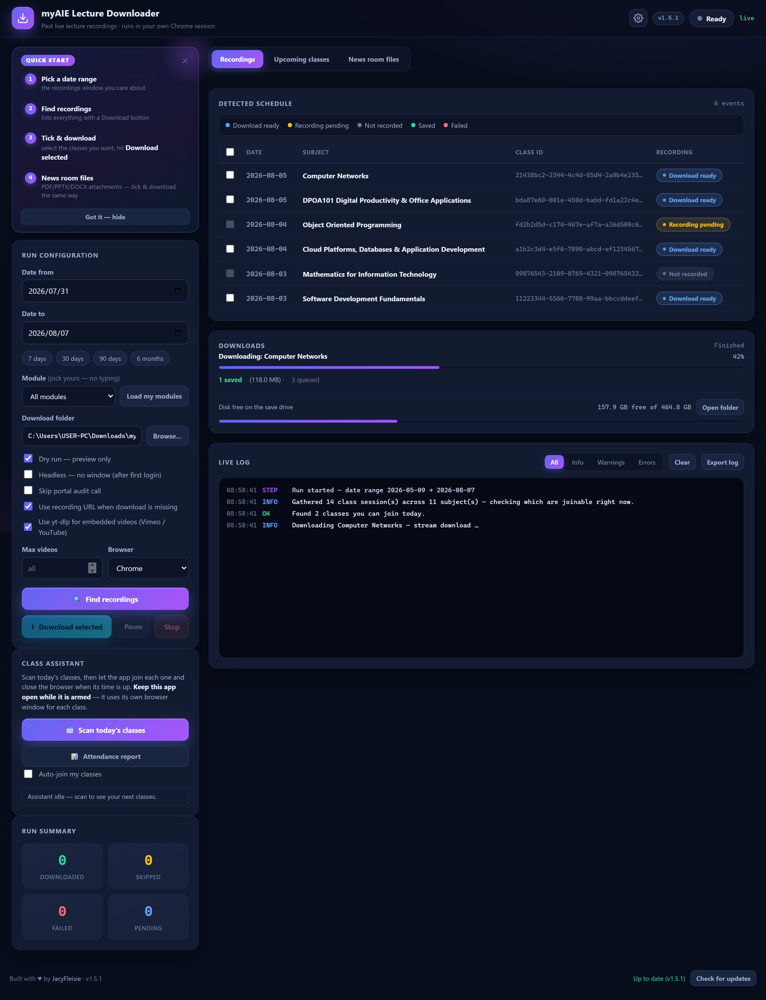
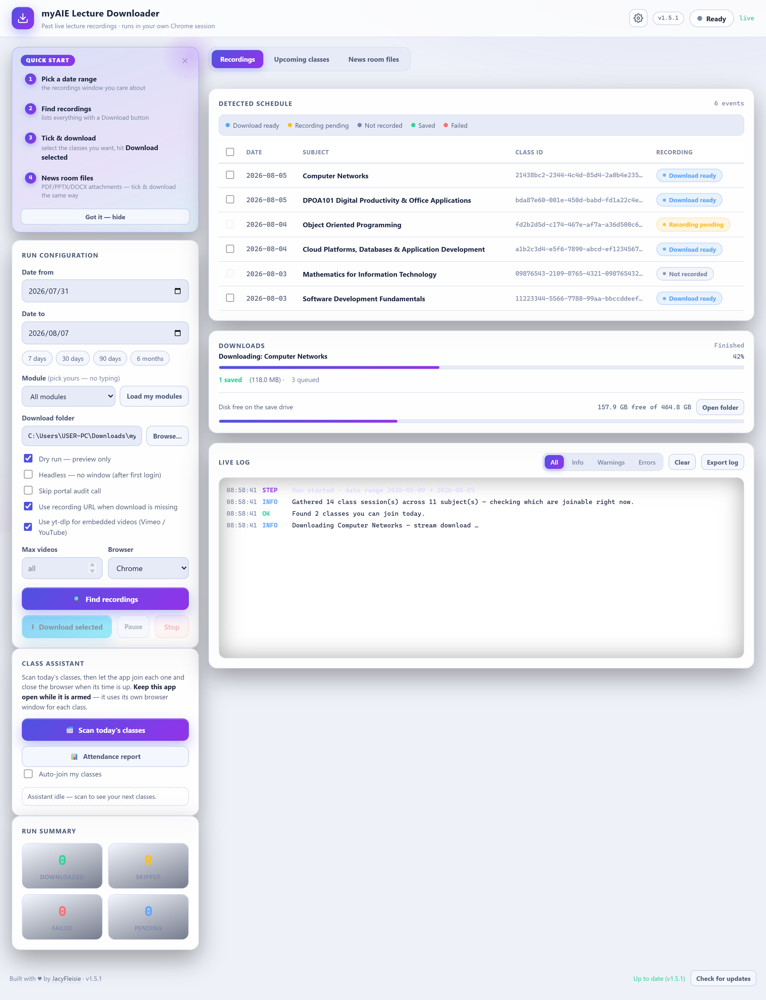
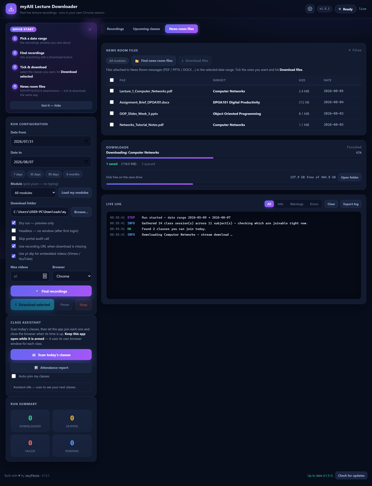

# 🎓 myAIE Lecture Downloader

**Download your lecture recordings automatically — and never miss a live class again.**

Built by [JacyFleisie](https://github.com/JacyFleisie) for the myAIE Student Portal.

[](https://github.com/JacyFleisie/myaie-recording-downloader/releases/latest)
[](https://github.com/JacyFleisie/myaie-recording-downloader/releases/latest)
[](https://github.com/JacyFleisie/myaie-recording-downloader/actions)
[](https://nodejs.org)
[](https://www.typescriptlang.org)
[](LICENSE)

> Pick a date range, and it works through your calendar schedule, finds every
> recording that has a download button, and saves the MP4s to a folder you
> choose. It can even **join your live classes for you** with the built-in
> Class Assistant — and it drives **your own logged-in Chrome session**, so no
> passwords are ever stored.

---

## 📑 Contents

- [✨ At a glance](#-at-a-glance)
- [📸 Screenshots](#-screenshots)
- [⬇️ Download the app](#️-download-the-app)
- [🚀 What it does](#-what-it-does)
- [🎯 Typical flow](#-typical-flow)
- [🤖 Class Assistant (auto-join)](#-class-assistant-auto-join)
- [🧠 How it works](#-how-it-works)
- [🖥️ Building the installer](#️-building-the-installer)
- [🔧 CLI reference](#-cli-reference)
- [🛠 Troubleshooting](#-troubleshooting)
- [📝 Changelog](#-changelog)

---

## ✨ At a glance

| | |
|---|---|
| 🎬 **Auto-downloads recordings** | Scans your calendar and saves every MP4 with a download button — MP4s, Vimeo/YouTube embeds, everything. |
| 🗂 **Module picker** | A dropdown of *your actual modules* from the portal. Pick one — no typing, no typos. |
| 📂 **News room files tab** | PDFs / PPTX / DOCX attachments in their own tab, with their own scan + download buttons. |
| 🤖 **Class Assistant** | Auto-joins your live classes (retrying until it gets in) and closes the tab when time is up. |
| 📊 **Downloads dashboard** | Live byte-progress bars, saved/skipped/failed totals, disk-space meter, pause/resume. |
| 🔔 **Tray + notifications** | Tray quick actions with a next-class countdown, Windows notifications, launch at login. |
| 📈 **Attendance report** | Everything the assistant did — joined / closed / skipped / failed — with CSV export. |
| 🔒 **Private by design** | Uses your own Chrome session; log in once, nothing stored or shared. |

## 📸 Screenshots

**The dashboard** — recordings, upcoming classes, downloads dashboard with live progress and disk meter:



**Light theme** for when the sun is out:



**The News room tab** — file attachments with their own scan/download controls:



## ⬇️ Download the app

**Windows users — no Node, no terminal, nothing else needed:**

[](https://github.com/JacyFleisie/myaie-recording-downloader/releases/latest)

1. Open the [latest release](https://github.com/JacyFleisie/myaie-recording-downloader/releases/latest) on GitHub.
2. Download **`myAIE Lecture Downloader Setup <version>.exe`**.
3. Run the installer and pick any install folder.
4. Launch **myAIE Lecture Downloader** from the Start menu — done.

The app **updates itself when you say so**: a **Check for updates** button in
the dashboard's footer looks for new versions published here on GitHub. The app
never checks, downloads, or installs on its own — so it never closes or
reinstalls itself without your go-ahead. When a new version is found you click
**Download update** (with live progress), then **Restart & install** whenever
you're ready.

## 🚀 What it does

- **Scans your calendar schedule** for a date range you choose (7d / 30d / 90d /
  6mo presets, or any custom range) and lists every recorded session with a
  status chip (Download ready / Recording pending / Not recorded / Saved).
- **Module picker — no typing.** Hit **Load my modules** and the app fetches the
  list of every module you're enrolled in, straight from the portal. Pick one
  from the dropdown and the scan looks at exactly that module — filtered by its
  real id, so it's both faster and always right.
- **Three tabs, one dashboard** — **Recordings**, **Upcoming classes**, and
  **News room files** each live in their own tab, and the app jumps to the right
  one when you start a scan or download.
- **Two-phase downloads** — hit **Find recordings** to see what's available
  first, tick the classes you want (or select all), then **Download selected**.
  No more downloading everything blindly.
- **News Room files** — the **News room files** tab scans your modules' news
  rooms and lists the file attachments (PDF / PPTX / DOCX …) in your date range,
  with sizes and subjects, so you can tick and download exactly the study
  material you need alongside the recordings.
- **Class Assistant (auto-join)** — **Scan today's classes** lists the classes
  you can join right now, then arm **Auto-join my classes** and the app opens
  each live class in its own tab, keeps retrying **Join** until it's in, and
  closes the browser when the class time is up — on its own. See below for
  details.
- **Downloads the recordings** as MP4s to a folder you pick — including
  embedded Vimeo/YouTube videos (via a bundled yt-dlp with your session's
  cookies), so nothing is missed.
- **Downloads dashboard** — the item currently downloading with a **real
  byte-progress bar**, running totals (saved / skipped / failed / queued), a
  **disk-space meter** that warns when space runs low, **Pause / Resume**, and
  an **Open folder** button.
- **Live dashboard** — a real-time log of everything the bot detects and does,
  a schedule table with status chips, and a run summary. Accessible by keyboard
  and screen reader, with a light and dark theme.
- **Tray quick actions** — right-click the tray icon for *Scan today's classes*,
  a live **next-class countdown**, Pause/Resume, and Open downloads folder —
  even while the window is hidden.
- **Attendance report** — every action the assistant took while auto-attend was
  armed (joined / closed / skipped / failed, with times and reasons), with
  **Export CSV** and **Print**.
- **Quality-of-life settings** — a dedicated Settings dialog: dark/light theme,
  desktop notifications, minimize-to-tray (the assistant keeps running in the
  background), launch-at-login, and a guard that asks before quitting while
  auto-attend is armed.
- **Resumes cleanly** — already-downloaded files are skipped on reruns, and
  your settings persist between sessions.
- **Your login stays private** — it reuses your real Chrome profile; you log in
  once (like on the website) and your session is reused, never stored or shared.

## 🎯 Typical flow

1. Pick a **date range** (or use a preset).
2. *(Optional)* hit **Load my modules** and pick the **module** you care about —
   or leave it on **All modules**.
3. **Find recordings** — the bot logs in, scans the calendar and lists each
   session with a status chip.
4. **Tick the recordings you want** and hit **Download selected** — only those
   download.
5. Head to the **News room files** tab — **Find news room files** scans the news
   rooms and returns file attachments (with size + subject + date). Tick and hit
   **Download files**.
6. **Class Assistant** — hit **Scan today's classes** to see what you can join
   right now, then flip on **Auto-join my classes** to have the app join each
   one and close the browser when its time is up.

Both lists keep their checkboxes between runs, and the CLI has matching flags
(`--scan-only`, `--select`, `--scan-files`, `--download-files`, and the
assistant's `--scan-upcoming` / `--auto-attend` — see the CLI reference).

## 🤖 Class Assistant (auto-join)

The dashboard's **Class assistant** card turns the app into your personal
attendance bot:

1. **Scan today's classes** — reads the rendered calendar page and lists
   **today's classes whose Join button is enabled** — the ones you can join
   right now (the portal unlocks a class's Join button close to its start
   time). Each row shows date, time, subject, class ID, live link, and status.
2. **Auto-join my classes** — arm the toggle and the app walks through the list
   in order:
   - waits until each class is **join-before minutes before it starts**
     (default **2 min**, configurable),
   - opens the class's live link in its own browser tab and **keeps retrying
     Join every ~20 seconds until it is actually in the class** — late-starting
     classes are no problem, it never gives up early,
   - holds the class open until **close-after minutes after its scheduled end**
     (default **1 min**, configurable) — it **never clicks a Leave button**,
     because classes can end early and Leave is unreliable,
   - when the class time is up it simply **closes the browser tab**, then
     restarts the process for the class matching the current/upcoming time and
     date (a class already in session is joined immediately, one whose window
     has passed is skipped) — redundant, but foolproof.

You get live feedback the whole time — "Waiting — will join Computer Networks
at 08:58", "In class — will close the tab at 09:31" — and each row flips to
**Joined ✓ / Closed ✓ / Skipped / Failed**.

**Built to handle real classes:**

- If a class starts late, the bot **keeps retrying every ~20 seconds until it
  gets in** (watching for the Join button and the page's "waiting for
  moderator" state), only closing the tab and moving on if the class never
  starts by the end of its scheduled window.
- Classes without a live link or a start time are skipped with a note.
- Join-URL detection never mistakes a download/recording link for a live link;
  end time comes from the portal, else the session duration, else a 1-hour
  default.
- If Join isn't found, the app **logs the buttons it actually sees on the page**
  so the click patterns can be fine-tuned to your portal's wording.
- You can't start a download run while the assistant is armed (and vice versa).

**Requirements:** keep the app open (and logged in) while armed — each class
opens in a tab inside the app, so closing the app mid-class drops you from that
session.

## 🧠 How it works

The portal's frontend was reverse-engineered from its own JavaScript bundles:

1. `GET /getAllSubjectCalendar` returns your **subjects** (e.g. `DPOA101 …`).
2. Each subject has a paginated **class feed** whose items carry a `ClassArray`
   — one entry per live session with `class_date`, `isRecorded`,
   `isRecordingAvailable` and a `recordings` HTML string.
3. Most sessions have **no `downloadURL` field** — the portal renders the
   "Download" button into that `recordings` HTML (a `url="…"` attribute pointing
   at `playback.myaie.ac/presentation_video/<meeting>/video.mp4`). The bot parses
   exactly what the portal page shows, so a session is "Download ready"
   precisely when you'd see a Download button on the site.

Downloads use a three-tier fallback chain — the browser download engine → a
cookie-authenticated streaming download → **yt-dlp** (which also handles
embedded Vimeo/YouTube with your exported session cookies). Files land as
`YYYY-MM-DD_Subject_classId.mp4`.

The Class Assistant reuses the same portal session: today's joinable classes
come from the rendered calendar page (the same rows you see in the browser),
with the events API and subject-calendar data as fallbacks, and live links are
picked from the page's own elements.

Want the full story? Read the [case study](docs/CASE_STUDY.md).

## 🖥️ Building the installer

For developers:

```bash
npm install            # install dependencies
npm run desktop        # launch the desktop app (Electron)
node gui-server.ts     # …or the same dashboard in your browser
node myaie-bot.ts --help   # …or the CLI
npm run dist           # produce dist\myAIE-Lecture-Downloader-Setup-x.y.z.exe
npm run publish        # build + upload the installer to GitHub releases
```

Requires **Node.js 22.18+** and **Google Chrome** (or Edge) installed.

### Code signing (removes the SmartScreen warning)

Unsigned builds show Windows' **"unknown publisher"** SmartScreen warning for
everyone who installs the app. Signing the installer kills that warning (and
makes the auto-updater verify the publisher of each update).

**It's automatic — you only need a certificate.** electron-builder signs every
executable and the installer itself whenever these two environment variables
are set:

```bash
# PowerShell (set once per terminal, or set them permanently under
# System Properties → Environment Variables)
$env:WIN_CSC_LINK = "C:\certs\myaie-signing.pfx"
$env:WIN_CSC_KEY_PASSWORD = "your-cert-password"

npm run dist   # → signed installer
```

What happens without a certificate:

- `npm run dist` / `npm run publish` run a pre-build check
  (`build/check-sign.mjs`). No credentials → it prints a warning and builds
  **unsigned** (everything still works, minus the SmartScreen warning).
- Credentials set but the `.pfx`/`.p12` file missing → the build **fails with
  a clear message** instead of silently shipping an unsigned installer.

**Get a certificate** (a real one costs money — no free option removes the
warning):

| Option | What it is | SmartScreen |
|---|---|---|
| **Self-signed** (test only) | generated on your own PC | still warns — your cert isn't trusted by Windows |
| **OV code-signing cert** | from a CA (DigiCert, Sectigo, SSL.com, …), ~$150–300/yr | warning fades as download reputation grows |
| **EV code-signing cert** | hardware-token bound, pricier | reputation builds immediately |

**Try the whole flow with a self-signed test certificate** (validates your
pipeline before you buy anything):

```powershell
# 1. Create a self-signed code-signing cert and export it as .pfx
$cert = New-SelfSignedCertificate -Type CodeSigningCert -Subject "CN=myAIE Lecture Downloader (TEST)" -CertStoreLocation Cert:\CurrentUser\My
$pwd = ConvertTo-SecureString -String "testpass123" -Force -AsPlainText
Export-PfxCertificate -Cert $cert -FilePath "$env:USERPROFILE\Desktop\myaie-test.pfx" -Password $pwd | Out-Null

# 2. Point the build at it and rebuild
$env:WIN_CSC_LINK = "$env:USERPROFILE\Desktop\myaie-test.pfx"
$env:WIN_CSC_KEY_PASSWORD = "testpass123"
npm run dist

# 3. Check the signature landed
Get-AuthenticodeSignature "dist\myAIE-Lecture-Downloader-Setup-1.5.0.exe" | Format-List Status,SignerCertificate
```

`Status: Valid` means signing works end to end. Installers signed with the
test cert still show the SmartScreen warning (Windows doesn't trust your own
certificate) — that's expected; only a CA-issued cert removes it.

## 📁 Project layout

```
electron/main.ts     Electron desktop wrapper (native window, manual updates, tray, launch-at-login)
gui-server.ts        Zero-framework HTTP + SSE dashboard server (incl. update, auto-attend, settings APIs)
bot-core.ts          The automation engine (Playwright, download chain, auto-join engine)
myaie-bot.ts         CLI entry point
public/              Dashboard UI (HTML/CSS/JS, accessible)
scripts/             Build helpers (icon, README screenshot capture)
docs/CASE_STUDY.md   The story behind the project
```

## 🧪 Tests & checks

```bash
npm run selftest     # engine self-test (real captured portal data)
npm run typecheck    # strict TypeScript, no build step (native type stripping)
```

## 🔧 CLI reference

| Option | Meaning |
|---|---|
| `--from <YYYY-MM-DD>` / `--to <YYYY-MM-DD>` | date range (default: last 90 days → today) |
| `--subject <text>` | only sessions whose subject contains text |
| `--subject-id <id>` | only look at the module with this id (from your portal's module list) |
| `--max <n>` | at most n downloads this run |
| `--dir <folder>` | save folder (default `./downloads`) |
| `--dry-run` | list what would download; download nothing |
| `--headless` | invisible Chrome (after logging in once) |
| `--no-audit` | skip the portal's audit call |
| `--fallback-recording` | use `recordingURL` when `downloadURL` is missing |
| `--yt-dlp` | use yt-dlp for embedded videos (Vimeo/YouTube); also a fallback for failed direct downloads |
| `--yt-dlp-path <path>` | yt-dlp executable (default: bundled `./yt-dlp.exe`) |
| `--channel <chrome\|edge>` | browser selection |
| `--login-timeout <sec>` | how long to wait for manual login (default 300) |
| `--scan-upcoming` | scan today's calendar and list the classes you can join right now; download nothing |
| `--auto-attend` | scan today's classes, then join each one (retrying until it starts) and close the tab when its time is up. Blocks until every class is handled. |
| `--join-lead <min>` | minutes before start to click **Join** (default 2) |
| `--close-grace <min>` | minutes after the scheduled end before closing the tab (default 1) |

Examples:

```bash
node myaie-bot.ts --scan-upcoming
node myaie-bot.ts --auto-attend --join-lead 3 --close-grace 2
```

The Class Assistant is available both in the desktop dashboard and through the
CLI (`--scan-upcoming` / `--auto-attend`).

## 🛠 Troubleshooting

- **"Failed to launch Chrome"** → try `--channel edge` or set the executable
  with `--executable-path "C:\Program Files\Google\Chrome\Application\chrome.exe"`.
- **Login timeout** → finish logging in within the window, or raise
  `--login-timeout`; your session persists in `./chrome-profile` afterwards.
- **HTTP 401/403** → the saved session expired. The app now notices this, opens
  the portal so you can log in again, and retries automatically — no manual
  rerun needed. If it still fails, the login timed out; raise
  `--login-timeout`.
- **Download failed / 403** → the recording's signed URL may have expired; rerun
  (already-downloaded files are skipped).
- **Scan shows no joinable classes** → the portal only enables a class's **Join**
  button close to its start time, so scanning early in the day can legitimately
  show none — scan again a few minutes before your class. If it still shows
  nothing right before a class, the log dumps the exact fields the portal
  returned; paste that log to the author.
- **Auto-join couldn't find Join** → the log prints the buttons the page
  actually shows; send it over and the click patterns get tuned to your portal.
- **Embedded video won't download** → see the yt-dlp note in the docs; on some
  networks Vimeo/YouTube are blocked at the network level (a VPN fixes it).
- **Dashboard port busy** → it auto-picks a free port in 3801–3820 (set `PORT`).

## 📜 Notes

- Personal use on your own account — respect your institution's policies on
  downloading lecture recordings.
- "Recording pending" means the portal recorded the class but the download isn't
  published yet; rerun later to pick it up.
- Found a bug or have an idea? Open an issue on GitHub.

---

## 📝 Changelog

**v1.5.1** *(latest)*

- **News room downloader is now its own tab.** The content area has tabs —
  **Recordings** / **Upcoming classes** / **News room files** — and the News
  room tab is self-contained: its own **Find news room files** and
  **Download files** buttons, plus a live chip showing the module it's
  scanning ("Module: Computer Networks" or "All modules"). The module picker
  from Run configuration applies to the news room scan too, and the app
  auto-switches to the right tab when you start a scan or download.

**v1.5.0**

- **Module picker — no more typing.** The free-text "Subject filter" is now a
  dropdown of **your actual modules**, fetched straight from the portal. Hit
  **Load my modules** (opens the browser briefly, like a scan) and every module
  you're enrolled in appears by name — pick one and the app scans/downloads
  exactly that module, filtered by its real id instead of fuzzy text (which
  also makes runs faster, since only that module's classes are fetched). The
  list is cached automatically: every scan or run refreshes it, so the
  dropdown fills itself after your first use. CLI: `--subject-id <id>`.

**v1.4.9**

- **Tooltips everywhere.** Every button and control now explains itself on
  hover (or on keyboard focus): the top bar (Settings, status pill, version),
  the date-range presets, the log filters and Export log, the update button,
  the settings dialog, the Auto-join toggle, and the class chips in the
  Upcoming table. Top-bar tooltips drop below the control so they never clip
  off-screen, the tooltip bubble is readable in both dark and light themes,
  and the checkbox tooltips now actually appear (previously the settings
  checkboxes could show an empty bubble).
- **Plain-language status.** Cryptic log lines are now written for people:
  "0 upcoming classes" became "No joinable classes right now — they unlock
  about 10 minutes before their start time", the scan summary reads "Gathered
  14 class session(s) across 11 subject(s) — checking which are joinable
  right now" (the technical breakdown moved to DEBUG), the Upcoming card says
  "None right now" instead of "0 classes", and the empty tables and CLI help
  text match the new today-only scan.

**v1.4.8**

- **Smarter scan: today's joinable classes.** The scanner no longer hunts
  through the next 7 days. It reads the rendered calendar page and lists only
  **today's classes whose Join button is enabled** — the ones you can actually
  join right now. Enable Auto-join and the app runs the entry retry protocol
  on them: it keeps retrying until you're in, holds the class, closes the tab
  at the end, and moves on. Classes with no direct link now still get joined
  via the fallback-URL rotation (they carry the portal's class ids).

**v1.4.7**

- **Upcoming-class scan fixed for real** — the portal's calendar page calls
  `getSubjectEventPageWiseTz` as a **POST with a JSON body** (confirmed by
  the page probe, which now logs the HTTP method and POST body): the full
  subject-id list, `status: "upcoming"`, and a date window. The scanner now
  makes that exact POST first. If the API still returns nothing, it falls
  back to **reading the rendered calendar page directly** — the same
  upcoming-class rows you see in the browser (dates, times, titles, ids) —
  so the scan works even if the API contract changes. The scan log now also
  prints exactly what POST was sent and what the API answered, so any
  remaining gap is visible in one scan.

**v1.4.6**

- **Tray quick actions** — right-click the tray icon for a live menu:
  *Scan upcoming classes*, a status line with the **next class and countdown**
  (*Next: Computer Networks in 2h 14m*), **Pause / Resume** for an active
  download run, and **Open downloads folder** — plus the tray tooltip shows
  the next class countdown so you can glance at it while the window is hidden.

**v1.4.5**

- **Downloads dashboard** — a live overview of every download run: the item
  currently downloading with a **real byte-progress bar** (stream and yt-dlp
  paths), running totals (saved / skipped / failed / queued), and a **disk
  meter** showing free space on the save drive with a warning when space runs
  low. Per-row progress bars appear right in the schedule and news-room
  tables.
- **Pause / Resume** — pause a run between files (the current file finishes
  first) and pick it back up whenever you're ready. The button sits next to
  Stop and the run state shows "Paused" while waiting.
- **Open folder** button on the dashboard — one click opens the download
  folder in your file manager.

**v1.4.4**

- **Bot active attendance report** — the assistant now keeps a session log of
  everything it did while auto-attend was armed (joined / closed / skipped /
  failed, with times and reasons). When you switch **Auto-join** off — or a
  session finishes on its own — the report opens automatically in its own
  window, and you can reopen it any time from the **Attendance report** button
  in the Class assistant card. The report shows live summary chips, a full
  activity table, and **Export CSV** + **Print** buttons.

**v1.4.3**

- **Reliability hardening for auto-attend**: arming now refreshes the scan
  first (a rescheduled, canceled or newly-added class is never missed), and
  classes without a join link get **fallback URL patterns** built from the
  portal's ids (portal class id / class UUID / BBB id) that the join loop
  rotates through — so a changed live route can't cost you a class. When a
  fallback works, the log reveals the portal's real live-link pattern.

**v1.4.2**

- **Settings moved into a dedicated dialog** — a gear button in the top bar
  opens a clean, grouped Settings window (Appearance, Notifications, Behavior,
  Class assistant timing) instead of cluttering the sidebar.

**v1.4.1**

- **Upcoming-class scan now actually finds your classes** — it reads the
  calendar's own events endpoint (`getSubjectEventPageWiseTz`), flattens its
  date-keyed response, and **walks every page**, so the full now → 7-day
  window is covered (not just page one).
- **Parses the portal's split date/time fields** — `class_date_rel` +
  `class_from_rel` (12-hour times like "8:00 am") and their end-time
  counterparts — and skips canceled classes.
- **Live-link recovery** — if a class has no join link in the API data, the
  scan looks for it on the calendar page itself and matches it by class id or
  subject; otherwise the class's fields are logged so the link can be pinned
  down.

**v1.4.0**

- **Class Assistant, close-based flow** — never gives up joining (retries
  every ~20s until the class actually starts), **never clicks a Leave button**;
  when the class time is up it closes the tab and restarts from the clock for
  the next class (already-started classes are joined immediately, passed
  windows are skipped).
- **Session-expired (HTTP 401/403) auto-recovery** — if your saved portal
  login goes stale, the app now opens the portal so you can log in again and
  **retries automatically** instead of failing the run.
- **New App settings card** — dark/light theme, desktop notifications (class
  joins/closes, finished downloads), minimize to tray (assistant keeps running
  in the background), start with Windows, and a warning before quitting while
  auto-attend is armed. Plus an **Export log** button on the live log.
- **CLI assistant flags** — `--scan-upcoming`, `--auto-attend`,
  `--join-lead <min>`, `--close-grace <min>`.

**v1.3.x**

- Class Assistant introduced — scan upcoming classes (now → 7 days) and
  auto-join them, with hardened date parsing and self-diagnostics when a scan
  finds nothing.

**v1.3.0**

- Updates became **fully manual** (Check for updates → Download → Restart &
  install) — the app never closes or reinstalls itself on its own.
- Native Windows folder picker for choosing the download folder.
